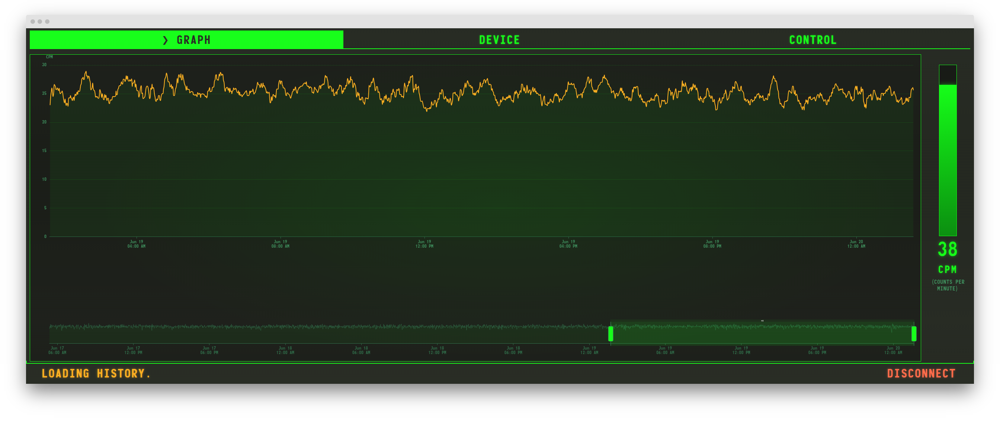
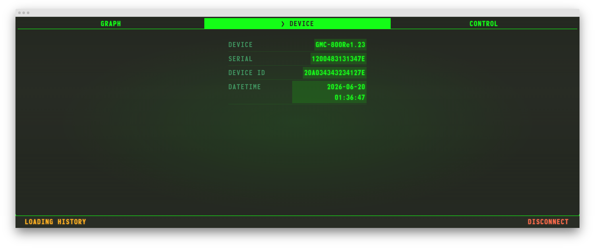
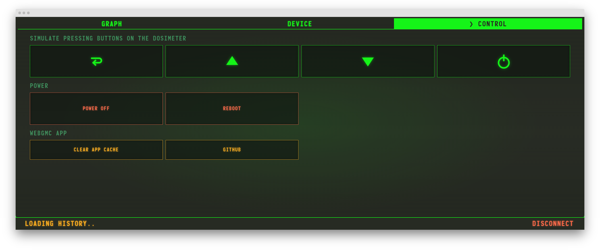

# WebGMC

**A Pip-Boy–styled web dashboard for the [GQ GMC-800](https://gqelectronicsllc.com/collections/geiger-counter/products/gmc-800) Geiger counter.**

Connect over USB, browse radiation history, watch live CPM, and drive the dosimeter from your browser — no native app required. Built with vanilla JavaScript, [WebSerial](https://developer.chrome.com/docs/capabilities/serial), and [Apache ECharts](https://echarts.apache.org/).

## Screenshots

### History graph & live CPM

Rolling 24-hour history with automatic CPS / CPM / CPH resolution by zoom range, plus a live vertical CPM meter that keeps updating while history loads.



### Device panel

Firmware version, serial number, device ID, and clock — with one-click sync to your computer's time when skew is detected.



### Control panel

Simulate front-panel keys, power off or reboot the dosimeter, clear the local SPIR page cache, or jump to the project on GitHub.



## Features

- **WebSerial link** — 115200 baud, GQ GMC command protocol, CH340-safe fixed-length transactions
- **Full ring download** — walks the 2 MB device history backward, progressive chart updates, IndexedDB page cache with overwrite invalidation
- **Live CPM meter** — `<GETCPM>>` polling once per second via a shared serial queue (meter stays live during graph load)
- **Demo mode** — explore the full UI with synthetic data; no hardware or WebSerial grant needed
- **CRT aesthetic** — Monofonto typography, phosphor-green scanlines, Fallout-inspired tabs and status bar

## Quick start

```sh
git clone https://github.com/anatoly-scherbakov/webgmc.git
cd webgmc
npm test          # syntax check + unit tests
npm run serve     # http://localhost:9658/
```

Open **http://localhost:9658/** in Chromium or Chrome. WebSerial needs a [secure context](https://developer.mozilla.org/en-US/docs/Web/Security/Secure_Contexts); `localhost` counts.

On the splash screen:

- **CONNECT** — pick your GMC-800 USB port (vendor `0x1a86`, CH340) and load real history
- **DEMO** — instant fake device with random CPM and a synthetic 24 h graph (works even without WebSerial)

## Requirements

| | |
|---|---|
| Browser | Chromium or Chrome with WebSerial |
| Hardware | GQ GMC-800 over USB (CONNECT mode only) |
| OS | Linux tested; macOS/Windows should work where WebSerial is available |

## Development

Parsing and graph logic are covered by `node --test webgmc.tests.js`. `npm run check` also runs `scripts/check-no-playwright.sh`, which rejects in-repo Playwright dependencies.

For agent workflows, serial protocol notes, and Playwright MCP validation checklists, see **[AGENTS.md](AGENTS.md)**.

## Credits

Splash product image adapted from [GQ Electronics LLC](https://gq-llc.myshopify.com/cdn/shop/files/GMC-800mainpic_300x300.jpg?v=1698266961). UI references collected in [docs/references.md](docs/references.md).

## License

MIT
